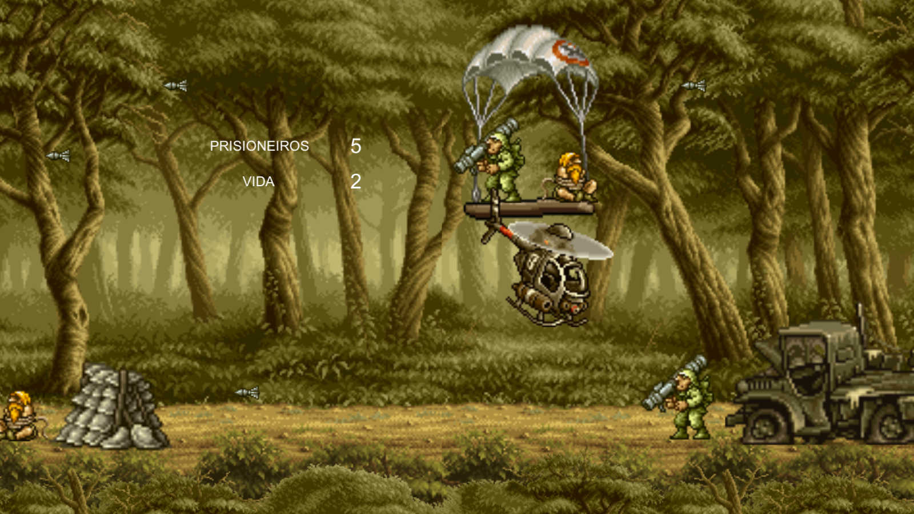

# Get 2 The Choppa!

Leia isto em [Português](README.md).

:video_game: Game inspired by the classic [Choplifter III](https://g.co/kgs/VB3G5z), where the objective is to rescue prisoners of war while surviving enemy attacks. This is the result of the Computer Graphics project, in the eighth semester of Computer Engineering at [Inatel](http://www.inatel.br/home/).

  - [Gameplay](#gameplay)
  - [How to Play](#how-to-play)
  - [References](#references)

## Gameplay

The game has 5 stages.
- Move the chopper with the arrows or WASD keys;
- Each stage has 5 prisoners to rescue;
- A prisoner is rescued on touch;
- 3 health points per stage;
- Each enemy or projectile touch subtracts 1 health point;
- Game over if health points reach 0;

## How to play
1. [Download](https://github.com/umluizlima/get-to-the-chopper/archive/master.zip) this repo;
2. Unzip the downloaded file;
2. Run **get-to-the-chopper.exe** from the folder **exec**;

## References
- [Metal Slug sprites](https://www.spriters-resource.com/neo_geo_ngcd/ms3/)
- [Unity version 2017.3.1f1](https://unity3d.com/pt/unity/whats-new/unity-2017.3.1)
