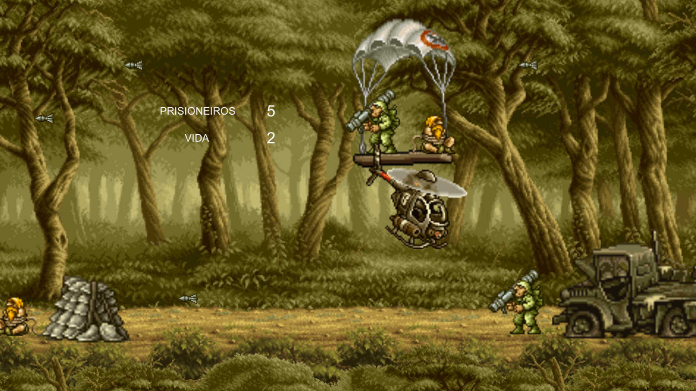

# Get 2 The Choppa!

Read this in [English](README.en.md).

:video_game: Jogo inspirado no clássico [Choplifter III](https://g.co/kgs/VB3G5z), onde o objetivo é resgatar prisioneiros de guerra enquanto sobrevive aos ataques de inimigos. Este é o resultado do projeto da disciplina de Computação Gráfica, no oitavo semestre de Engenharia da Computação no [Inatel](http://www.inatel.br/home/).

  - [Jogabilidade](#jogabilidade)
  - [Como jogar](#como-jogar)
  - [Referências](#referências)

## Jogabilidade

O jogo tem 5 fases.
- Controle o helicóptero através das setas ou das teclas WASD;
- Cada fase tem 5 prisioneiros para resgatar;
- Um prisioneiro é resgatado ao tocar;
- 3 pontos de vida por fase;
- Cada toque em um inimigo ou em um foguete subtrai 1 ponto de vida;
- Quando a vida chega a zero o jogo recomeça;

## Como jogar
1. Faça o [download](https://github.com/umluizlima/get-to-the-chopper/archive/master.zip) deste repositório;
2. Descompacte o arquivo baixado;
2. Dentro da pasta **exec**, execute o arquivo **get-to-the-chopper.exe**

## Referências
- [Sprites do jogo Metal Slug](https://www.spriters-resource.com/neo_geo_ngcd/ms3/)
- [Unity versão2017.3.1f1](https://unity3d.com/pt/unity/whats-new/unity-2017.3.1)
